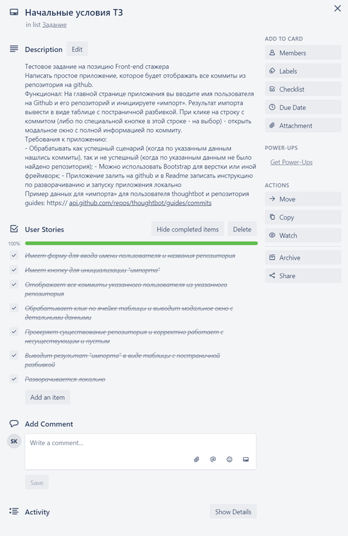

<h1 align="center">
  
</h1>

Привет, WIS Software,

В этом репозитории я постарался выполнить требования вашего задания на стажировку. Это было непросто, постоянно хотелось добавить украшательств. Чтобы бороться с искушением я раскидал задачи на доске в трелло [вот тут](https://trello.com/b/X0NsnILV/wis).  
  
  
Для вашего удобства ниже список требований, которые я увидел в тексте:
**📖 Тут небольшой указатель:** 
- [Приложение простое](#простое)
- [Имеет форму для ввода имени пользователя и названия репозитория](#форма)
- [Имеет кнопку для инициализации "импорта"](#кнопка)
- [Отображает все коммиты указанного пользователя из указанного репозитория](#коммиты)
- [Обрабатывает клик по ячейке таблицы и выводит модальное окно с детальными данными о коммите](#модальное-окно)
- [Проверяет существование репозитория и корректно работает с несуществующими](#существование)
- [Выводит результат "импорта" в виде таблицы с постраничной разбивкой](#пагинация)
- [Разворачивается локально](#разворачивается)
- [Maintainers](#maintainers)
- [Contributing](#contributing)
- [License](#license)

> ☝ **NOTE: Вы сами написали "простое приложение" :)**

Предлагаю по этим требованиям и пойти.

## Простое
Раз приложение простое, то для начала я решил не использовать сторонних библиотек и писать все самостоятельно. Для начала решил написать прототип и реализовать основной функционал. Составил список требований, записал все в карточку "Создание функционального прототипа" и пошел по списку. Где-то в середине понял, что городить изначально запланированные классы для хранения данных в примере на 150 строк кода особенно и не нужно и решил глубже функций в абстракции не нырять. Но я знаю как работать с классами, честно-честно!. И чем `__proto__` от `prototype` отличается расскажу и как прототипное наследование работает знаю. 
От мысли парсить то, что получается по ссылке из задания удалось сразу отказаться в пользу почитать про API гитхаба. Поэтому парсер с фейерверками и костылями в следующий раз. Из интересного есть пара обращений к fetch (в одном месте попробовал через async/await, в другом, как завещали в документации, через .then), да пара мест где удалось впихнуть map и forEach. Есть еще использование header вида `"application/vnd.github.cloak-preview"`, без него API коммиты не отдает, говорит функционал в тестовом режиме. Но я решил сделать именно так, чтобы вообще понять куда этим header в fetch тыкать. 

## Форма
Для ввода данных взял форму, позже в нее же добавил и таблицу для вывода результатов. И в целом решил все запаковать в один узел DOM чтобы получился встраиваемый виджет. Назвал внешний контейнер в честь функционала - ghSearch. В HTML решил часть структуры создать руками, а часть генерировать из JS. Можно было бы все сгенерировать, но тогда было бы много воды к скрипте. А по генерации таблицы с кнопками и так видно, что я немножко читал про работу с DOM из JS.
Использовал `fieldset` с легендой и решил что дизайн результата годится (согласно пункту 1 требований). Только подвинул поля ввода и их лейблы немного флексами и оставил так. Лейблы работают, а еще я кинул в них name чтобы тянуть данные через `document.forms.formName.fieldName`. Не то, чтобы это best practice, просто для демонстрации разных способов доступа к данным.

## Кнопка
Кнопку сделал через `input type="submit"`, чтобы потом повесить на нее обработчик и отменить дефолтное поведение. В целом, обработчик на этой кнопке отвечает за начало работы всего скрипта путем вызова renderData (он же по совместительству главная функция). В начальных коммитах я передавал туда введенные в input данные и в недрах рендера формировал ссылки для API и делал много неподобающих вещей. Например, добавил параметр для работы с разными типами ссылок и передавал renderData(username, reponame, url). Закономерно, что в одном месте вылез демонический вызов renderData(null, null, url). После чего я представил, как:
- вы это читаете
- заходите в тело функции
- натыкаетесь на проброс параметров в getCommit()
- идете туда
- там натыкатесь на костыли
- чтобы просто понять что это за (null, null) были
- разочаровываетесь в людях
Это классическая ситуация, на которую жаловался господин Немчинский, видео которого о качестве кода сильно запали мне в душу.
В общем, на финальном рефакторинге я убрал из renderData все, кроме рендеринга. А в целях переиспользования (когда появилась реализация пагинации) переписал основную функцию так, чтобы она принимала только URL и соответственно одинаково работала во всех сценариях. Естественно переименовал в renderDataByUrl(url: string).

## Коммиты
Для отображения коммитов используется все та же `renderDataByUrl`. В ней я очищаю вывод путем удаления всех дочерних нодов из таблицы и удаления аналогичным методом контейнера для кнопок пагинации. Мне очень понравится метод:
<pre>
while (table.firstChild) {
    table.removeChild(table.firstChild);
  }  
</pre>
Если вы это читаете, напишите мне, какой метод очистки таблицы использовали бы тут вы? Мне кажется быстрее удалить ноду таблицы и создать пустую таблицу, но очень понравилась использованная реализация :)
Затем идет запрос к API гитхаба через fetch (этот я реализовал в `getCommits` через asynс/await как раз).
Затем рендер таблицы по полученным от гитхаба данным. Его я разбил для читабельности на три последовательные функции, отвечающие за рендер заголовка таблицы, содержимого таблицы и кнопок пагинации. 

## Модальное окно
Решил реализовать банальным перекрытием рабочей области дивом с zlevel. Див отключает скролл основной страницы и скроллит свое содержимое. Добавил ему обработчик клика, который его и закрывает. Проще некуда, хотя строка `white-space: pre;` мне стоила часа два акробатики с обработкой промиса после fetch. Без нее вывод полных данных о коммите был однострочный и никак не поддавался. Хотя это было ночью, может быть я был уже неработоспособен.

## Существование
Репозитория проверяю наверное самым банальным способом `if (!response.ok) { return false }` в функции getCommits. Затем, в основной функции если `if(!commits) {    return renderBadRequestMessage();}` то вызываю обработчик, который перехватывает рендер и завершает его сообщением об ошибке.

## Пагинация
Осуществляется через вызов `response.headers.get("link")` после получения данных от fetch. Раз API гитхаба отдает информацию о ссылках на соседние страницы, решил не изобретать велосипед, распарсил эти данные и раскидал ссылки по массиву объектов вида `{url: ... ,title: ...}`. Далее по этому массиву проходит функция, создающая кнопки с текстом из title, а ссылкой из url. Таким образом кнопки перехода на соседние страницы генерируются автоматически. Опять же, можно добавить кнопки для каждой страницы, а не как в моей реализации, но мне так понравилось как просто работает автогенерация кнопок, что я не мог ее не оставить.

## Разворачивается
Инструкции по локальному разворачиванию вызвали замешательство. Когда написался прототип стало понятно, что скрипт достаточно простой. Примеры использования `GULP` у меня в репозиториях есть. На начальном уровне я его знаю. Прикручивать к этой работе шаблонизатор, или препроцессор CSS для 50 строчек, или минификаторы кода? Попробую и тут прикрыться п.1. 
Для вашего удобства выставил репозиторий на [gitpages](https://skrikl.github.io/WIS-test/). Локально развернуть проект можно через `git clone git@github.com:skrikl/WIS-test.git` и запустив индекс :). 
Вот и все, что я хотел написать в сопроводительном письме. 
Надеюсь с вами увидеться на стажировке!

## Maintainers

[@skrikl](https://github.com/skrikl)

## Contributing

PRs accepted.

Small note: If editing the README, please conform to the [standard-readme](https://github.com/RichardLitt/standard-readme) specification.

## License

MIT © 2019 Sergey Kriklivyy
